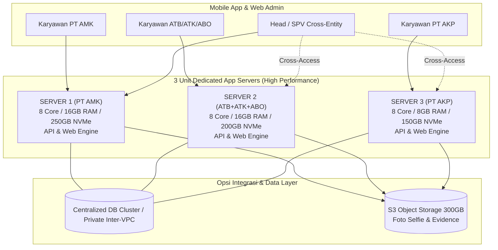
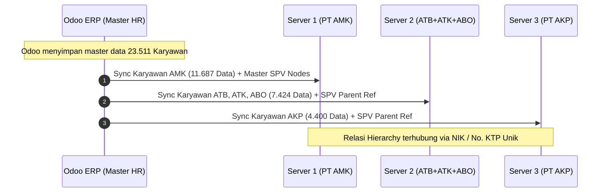

# ARSITEKTUR INFRASTRUKTUR & STRATEGI SINKRONISASI CROSS-ENTITY
## Sistem Presensi & Pelaporan Lapangan ESA Groups (23.511 Karyawan)

---

## 1. Latar Belakang & Tantangan Hierarki Lintas Entitas

Pada operasional ESA Groups, terdapat kondisi hierarki organisasi di mana:
* **Seorang Supervisor (SPV), Koordinator Area, Field Coordinator, atau Head** terdaftar secara administratif di satu entitas (misal: *PT Arina Multi Karya* di Server 1), namun membawahi staf/SPG/MD lapangan yang terdaftar di entitas lain (misal: *PT Anugrah Talenta Berkarya* di Server 2 atau *PT Alva Karya Perkasa* di Server 3).
* **Alur Persetujuan (*Approval Workflow*):** Pengajuan Cuti, Izin, Lembur, Tukar Shift, dan Laporan Kunjungan (*Visit Reports*) dari bawahan di Server 2/3 harus dapat dilihat dan disetujui (*Approve/Reject*) oleh SPV di Server 1.
* **Monitoring & Live Tracking:** Head/SPV harus dapat melihat dashboard monitoring kehadiran dan posisi timnya secara *real-time* tanpa memandang entitas asal anggotanya.

---

## 2. Komparasi 3 Opsi Arsitektur Server & Sinkronisasi

Berikut analisis 3 pendekatan arsitektur untuk menangani kondisi ini:

---

### OPSI 1: Multi-App Server dengan Private Inter-VPC Database / Central Hub (⭐ PALING DIREKOMENDASIKAN)

#### Cara Kerja:
1. **Pemisahan Traffic Komputasi (App Layer):** 3 unit Cloud VPS masing-masing menjalankan Nginx, PHP-FPM, Redis Cache, dan API Gateway khusus untuk melayani entitasnya. Seluruh proses berat seperti kompresi foto selfie, kalkulasi geofence GPS, dan export excel ditangani oleh server masing-masing sehingga **bebas dari bottleneck antrean**.
2. **Data Layer Terhubung via Private Network (Inter-VPC):** Ketiga server berada dalam satu *Local Private Network (VPC)* dengan latency ultra-rendah (<1 ms).
3. **Database Architecture:**
   * Server 1 (atau database cluster khusus) bertindak sebagai *Database Host Utama* dengan multi-tenant schema terisolasi, atau
   * Menggunakan PostgreSQL multi-schema (`amk_schema`, `atb_schema`, `akp_schema`) dengan tabel *Global Master Hierarchy* (`employees`, `users`, `hierarchy_nodes`).

#### Keunggulan:
* ✅ **100% Real-Time:** Approval Cuti/Lembur/Kunjungan langsung masuk ke notifikasi SPV seketika tanpa ada jeda waktu sync.
* ✅ **Zero Redundancy:** Tidak ada duplikasi data karyawan yang berisiko inkonsisten.
* ✅ **Single Sign-On (SSO) Mulus:** SPV cukup login dengan 1 akun, mobile app otomatis memuat seluruh bawahan lintas entitas.
* ✅ **Beban Komputasi Tetap Terbagi:** Traffic 23.511 karyawan tetap terdistribusi rata di 3 server app engine.

---

### OPSI 2: 3 Server Terisolasi Mandiri + Internal Event-Driven API Sync (Webhooks / REST Service)

#### Cara Kerja:
1. Ketiga server memiliki Database lokal masing-masing yang berdiri sendiri secara terpisah.
2. Ketika staf di Server 2 (ATB) mengajukan Cuti/Lembur/Laporan:
   * Sistem mendeteksi bahwa SPV-nya berada di Server 1 (`company_id = AMK`).
   * Server 2 secara otomatis mengirimkan secure payload (*Webhook / Internal Signed API*) ke Server 1.
3. Notifikasi muncul di aplikasi mobile SPV di Server 1.
4. Saat SPV mengklik *Approve*, Server 1 mengirimkan sinyal konfirmasi balik (*callback*) ke Server 2 untuk memperbarui status kehadiran.

#### Keunggulan:
* ✅ **Isolasi Database 100% Fisik:** Masing-masing server memiliki database fisik terpisah total.
* ✅ **Fault-Tolerant:** Jika Server 2 mengalami *maintenance*, Server 1 dan Server 3 tetap dapat melayani presensi secara mandiri.

#### Tantangan:
* ⚠️ Membutuhkan mekanisme *retry queue* (Redis Job Queue) jika koneksi antar server sempat terputus saat pengiriman webhook.
* ⚠️ Terdapat jeda sinkronisasi minor (1–3 detik) saat delegasi persetujuan.

---

### OPSI 3: 3 Server Mandiri + PostgreSQL Foreign Data Wrapper (FDW) / Database Federation

#### Cara Kerja:
1. Tiap server memiliki database lokal.
2. Fitur **PostgreSQL FDW (*Foreign Data Wrapper*)** diaktifkan antar server melalui jalur Private Network / WireGuard VPN.
3. Tabel `employees` dan `attendance_approvals` di Server 2 dan Server 3 dipetakan sebagai *Foreign Table (Virtual Table)* di Server 1.
4. Ketika SPV membuka menu *Approval Tim*, database Server 1 melakukan *federated query* secara otomatis ke Server 2 dan 3 di latar belakang.

#### Keunggulan:
* ✅ Tidak perlu membuat webhook custom rumit; database PostgreSQL menangani kueri lintas server secara native.
* ✅ Struktur hak akses per entitas tetap terjaga.

---

## 3. Strategi Sinkronisasi Master Data dari Odoo

Untuk menjaga konsistensi NIK dan struktur organisasi dari Odoo ke 3 Server:

### Aturan Sinkronisasi Odoo:
1. **Identifikasi Kunci Unik (NIK / No. KTP):**
   * Pencocokan hirarki atasan-bawahan menggunakan **NIK / Nomor KTP Nasional**.
   * Jika seorang SPG di Server 2 (ATB) memiliki field `parent_id` (Manager) di Odoo yang berasal dari PT AMK, sistem menyimpan relasi `supervisor_nik = [NIK_SPV_AMK]`.
2. **Jadwal Sync Otomatis:**
   * Sinkronisasi data karyawan terjadwal via Background Cron (pukul 01:00 WIB dini hari) di masing-masing server secara paralel, sehingga tidak membebani jam operasional kerja.
3. **Penyimpanan Media Bukti (Offload ke Object Storage):**
   * Seluruh foto selfie presensi, bukti kunjungan toko, dan scan dokumen langsung diunggah ke **S3-Compatible Object Storage (Gratis 3x 100 GB)**.
   * Ketiga server dapat membaca dan menampilkan foto evidence yang sama melalui URL terenkripsi yang aman.

---

## 4. Rekomendasi Implementasi Bertahap (Roadmap)

### Fase 1: Setup Multi-Instance App Engine & Private Networking (Minggu 1)
* Mengaktifkan 3 unit Cloud VPS Multiverse Ultra di region/data center yang sama.
* Menghubungkan ketiga server menggunakan **Private Local IP (Inter-VPC)** berkecepatan 10 Gbps internal.
* Mengaktifkan Gratis 3x 100 GB S3 Object Storage untuk penyimpanan media presensi terpusat.

### Fase 2: Implementasi Cross-Entity Routing & Hierarchy Lookup (Minggu 2)
* Mengonfigurasi relasi atasan-bawahan berbasis NIK global.
* Mengimplementasikan arsitektur hybrid (**Opsi 1 / Opsi 2 via Internal Signed API**) agar modul Approval Cuti, Lembur, dan Visit Reports dapat diakses lintas server secara mulus.

### Fase 3: Testing & Simulasi Beban Jam Sibuk (Minggu 3)
* Menjalankan simulasi transaksi 23.511 karyawan di jam puncak presensi (06:30–08:30 WIB).
* Memastikan waktu respon API tetap stabil di bawah **200 ms** dan approval lintas entitas terverifikasi 100% akurat.
