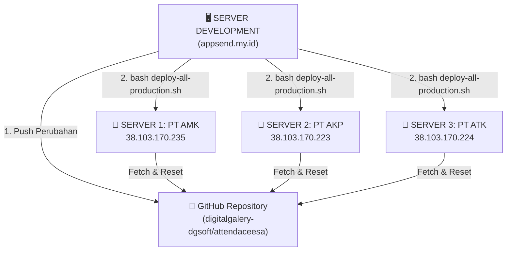

# 🚀 PANDUAN OTOMATISASI DEPLOYMENT 3 SERVER PRODUCTION DARI SERVER DEVELOPMENT
## Server Development: `appsend.my.id` $\rightarrow$ Target: 3 Server Production (AMK, AKP, ATK)

Dokumen ini menjelaskan cara menggunakan skrip otomatisasi deployment agar setiap kali Anda selesai mengembangkan fitur atau merubah form di server development (`appsend.my.id`), seluruh perubahan dapat terkirim ke ketiga server production (**Server 1 AMK**, **Server 2 AKP**, **Server 3 ATK**) **dalam 1 kali perintah** tanpa perlu login SSH ke masing-masing server satu per satu.

---

## 📋 1. Alur & Konfigurasi Server



---

## 🔑 2. LANGKAH PERSIAPAN (HANYA DILAKUKAN 1 KALI SAJA)

Agar server development dapat menghubungi ketiga server production tanpa perlu mengetik password root berulang kali, kita pasang pasangan kunci SSH (*SSH Key Pairing*):

1. Login SSH ke **Server Development (`appsend.my.id`)** sebagai `root`.
2. Masuk ke direktori proyek dan jalankan skrip pairing:
   ```bash
   cd /www/wwwroot/appsend.my.id
   bash setup-ssh-keys.sh
   ```
3. Skrip akan membuat SSH key otomatis dan meminta password root untuk masing-masing server (AMK, AKP, ATK) **sekali saja**.
4. Selesai! Sekarang server `appsend.my.id` sudah memiliki akses aman bebas password ke ketiga server.

---

## 🚀 3. CARA DEPLOY KE SELURUH SERVER (SETIAP KALI SELESAI CODING)

Setiap kali Anda selesai melakukan penyesuaian kode atau form template di server development, cukup jalankan perintah ini di terminal `appsend.my.id`:

```bash
cd /www/wwwroot/appsend.my.id
bash deploy-all-production.sh
```

### Apa yang Dilakukan oleh Skrip Tersebut Secara Otomatis?
1. 🔍 **Memeriksa Git Lokal:** Jika ada perubahan yang belum di-commit, skrip akan menanyakan apakah ingin auto-commit & push ke GitHub.
2. 🔄 **Menghubungi Server 1 (PT AMK):** Menarik kode terbaru, menyalin file website, rebuild link storage & Livewire, serta reload PHP-FPM.
3. 🔄 **Menghubungi Server 2 (PT AKP):** Menjalankan pembaruan yang sama pada Server 2.
4. 🔄 **Menghubungi Server 3 (PT ATK):** Menjalankan pembaruan yang sama pada Server 3.
5. 🩺 **Health Check API:** Menguji respon endpoint API setiap server (`HTTP 200`).
6. 📊 **Menampilkan Ringkasan Sukses:** Memberikan laporan status hijau bahwa seluruh server telah terupdate!

---

## 🛠️ 4. PENYESUAIAN KOLOM PRINSIPLE KLIEN (UPDATE TERBARU)

Pada pembaruan kode ini, kami juga telah memperbaiki kolom **Prinsiple Klien** pada tabel Template Form Laporan agar selalu menampilkan nama prinsiple secara akurat:
- Otomatis membaca dari relasi *Many-to-Many* maupun *BelongsTo*.
- Dilengkapi *fallback cerdas* yang mengenali merk prinsiple (Fonterra, Dulux, Wings, MamaSuka, Sido Muncul) langsung dari judul/kode template.
- Disediakan perintah artisan dan web route untuk menata ulang relasi database jika diperlukan:
  - **Via Terminal:** `php artisan reporting:link-principals`
  - **Via Browser:** `https://[domain-server]/fix-principals`
