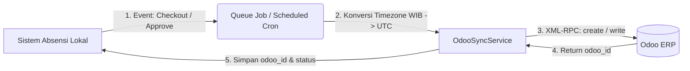

# Rencana Implementasi: Sinkronisasi Data Sistem ke Odoo (Reverse / Push Sync)

Dokumen ini memuat arsitektur, rancangan skema, alur teknis, dan tahapan implementasi untuk mengirim data dari **Sistem Presensi Lokal (att-admin-v12)** ke **Odoo ERP (*Push Sync*)**.

---

## 1. Arsitektur & Gambaran Umum

Saat ini sistem telah memiliki modul `OdooSyncService` yang membaca data dari Odoo menggunakan method XML-RPC `search_read` (Odoo $\to$ Sistem).
Untuk arah sebaliknya (Sistem $\to$ Odoo), sistem akan memanfaatkan method ORM standar Odoo melalui koneksi XML-RPC yang sudah ada:
- **`'create'`**: Membuat record baru di Odoo.
- **`'write'`**: Memperbarui record yang sudah ada di Odoo.



---

## 2. Pemetaan Data & Model Odoo

| No | Modul Sistem Lokal | Target Model Odoo | Aksi Utama | Keterangan & Aturan Bisnis |
| :--- | :--- | :--- | :--- | :--- |
| 1 | **Presensi Masuk/Pulang** (`attendances`) | `hr.attendance` | `create` saat check-in, `write` saat checkout | Mengirim jam masuk (`check_in`) & jam pulang (`check_out`). Odoo mewajibkan format datetime **UTC**. |
| 2 | **Cuti / Izin / Sakit** (`leave_requests`) | `hr.leave` (*Time Off*) | `create` saat status `approved` | Mengirim jenis cuti (`holiday_status_id`), tanggal mulai & selesai, serta durasi hari. |
| 3 | **Lembur Disetujui** (`overtimes`) | `hr.attendance` / Modul Payroll Odoo | `create` / `write` | Tergantung modul payroll Odoo yang diaktifkan perusahaan. |
| 4 | **Profil Karyawan** (`employees`) | `hr.employee` | `write` | Sinkronisasi perubahan mandiri nomor HP, kontak darurat, foto profil. |

---

## 3. Penyesuaian Skema Database Lokal

Agar sistem dapat melacak apakah suatu data sudah pernah dikirim ke Odoo dan mencegah duplikasi, kolom berikut perlu ditambahkan melalui migrasi Laravel:

### A. Tabel `attendances`
- `odoo_attendance_id` (`bigInteger`, nullable, indexed) : Menyimpan ID dari `hr.attendance` di Odoo.
- `odoo_sync_status` (`enum: ['pending', 'synced', 'failed']`, default `'pending'`).
- `odoo_synced_at` (`timestamp`, nullable).
- `odoo_sync_error` (`text`, nullable).

### B. Tabel `leave_requests`
- `odoo_leave_id` (`bigInteger`, nullable, indexed) : Menyimpan ID dari `hr.leave` di Odoo.
- `odoo_sync_status` (`enum: ['pending', 'synced', 'failed']`, default `'pending'`).
- `odoo_synced_at` (`timestamp`, nullable).

---

## 4. Standar Penanganan Waktu & Timezone (Wajib UTC)

Odoo menyimpan seluruh field `fields.Datetime` dalam format **UTC (Greenwich Mean Time)** tanpa offset.
Sedangkan database lokal menyimpan waktu lokal karyawan (WIB = UTC+7, WITA = UTC+8, WIT = UTC+9).

**Aturan Konversi Sebelum Mengirim ke Odoo:**
```php
// Contoh konversi sebelum push ke Odoo
$employeeTz = $employee->timezone ?? 'Asia/Jakarta';

$checkInUtc = Carbon::parse($attendance->checkin_at, $employeeTz)
    ->setTimezone('UTC')
    ->format('Y-m-d H:i:s');

$checkOutUtc = $attendance->checkout_at 
    ? Carbon::parse($attendance->checkout_at, $employeeTz)->setTimezone('UTC')->format('Y-m-d H:i:s')
    : false;
```

---

## 5. Contoh Rancangan Method di `OdooSyncService.php`

```php
/**
 * Push presensi lokal ke Odoo hr.attendance
 */
public function pushAttendance(Attendance $attendance): array
{
    $uid = $this->authenticate();
    $employee = $attendance->employee;

    if (!$employee || !$employee->odoo_id) {
        throw new \Exception("Karyawan {$employee->full_name} belum tertaut dengan Odoo (odoo_id kosong).");
    }

    $employeeTz = $employee->branch?->timezone ?? $employee->company?->timezone ?? 'Asia/Jakarta';

    $checkInUtc = Carbon::parse($attendance->checkin_at, $employeeTz)
        ->setTimezone('UTC')
        ->format('Y-m-d H:i:s');

    $checkOutUtc = $attendance->checkout_at 
        ? Carbon::parse($attendance->checkout_at, $employeeTz)->setTimezone('UTC')->format('Y-m-d H:i:s')
        : false;

    // JIKA BELUM ADA DI ODOO: Lakukan 'create'
    if (empty($attendance->odoo_attendance_id)) {
        $vals = [
            'employee_id' => (int) $employee->odoo_id,
            'check_in'    => $checkInUtc,
        ];
        if ($checkOutUtc) {
            $vals['check_out'] = $checkOutUtc;
        }

        $odooId = $this->xmlRpcCall('/xmlrpc/2/object', 'execute_kw', [
            $this->db, $uid, $this->apiKey,
            'hr.attendance', 'create',
            [$vals]
        ]);

        $attendance->update([
            'odoo_attendance_id' => $odooId,
            'odoo_sync_status'   => 'synced',
            'odoo_synced_at'     => now(),
            'odoo_sync_error'    => null,
        ]);

        return ['action' => 'created', 'odoo_id' => $odooId];
    }

    // JIKA SUDAH ADA DI ODOO: Lakukan 'write' (update jam pulang jika ada)
    if ($checkOutUtc) {
        $this->xmlRpcCall('/xmlrpc/2/object', 'execute_kw', [
            $this->db, $uid, $this->apiKey,
            'hr.attendance', 'write',
            [
                [(int) $attendance->odoo_attendance_id],
                ['check_out' => $checkOutUtc]
            ]
        ]);

        $attendance->update([
            'odoo_sync_status' => 'synced',
            'odoo_synced_at'   => now(),
            'odoo_sync_error'  => null,
        ]);

        return ['action' => 'updated', 'odoo_id' => $attendance->odoo_attendance_id];
    }

    return ['action' => 'noop'];
}
```

---

## 6. Pilihan Pemicu Sinkronisasi (*Trigger Mechanisms*)

1. **Otomatis Asinkron (*Queue Jobs*)**:
   - `App\Jobs\PushAttendanceToOdooJob`: Dipicu segera setelah karyawan melakukan Check-Out atau saat admin menyetujui koreksi presensi.
   - Keuntungan: Tidak membebani respons API mobile/web presensi pengguna.
2. **Batch / Jadwal Otomatis (*Scheduled Task*)**:
   - Perintah artisan harian `php artisan odoo:push-attendances --date=today`.
   - Dijalankan setiap pukul 23:45 WIB via Laravel Scheduler untuk memastikan presensi yang sempat tertunda/gagal koneksi terkirim ulang (*auto-retry*).
3. **Manual via Filament Admin**:
   - Tombol *"Kirim Presensi ke Odoo"* di halaman Filament Attendance Table atau menu khusus Odoo Push Report dengan filter tanggal dan entitas.

---

## 7. Prasyarat & Keamanan di Sisi Odoo

1. **Hak Akses User Odoo (API Key)**:
   - User Odoo yang digunakan pada pengaturan Company wajib memiliki grup akses **Attendance / Administrator** atau **Officer** agar memiliki hak akses `create` dan `write` pada model `hr.attendance`.
2. **Validasi Overlapping Odoo**:
   - Modul `hr.attendance` di Odoo melarang check-in ganda sebelum check-out sebelumnya terisi. Sistem lokal harus memastikan urutan kirim data tidak bertabrakan.
3. **Pencatatan Log**:
   - Seluruh aktivitas push tetap dicatat di tabel `odoo_sync_logs` agar tim HR/IT dapat memantau jika ada koneksi timeout atau error validasi dari Odoo.

---

## 8. Rencana Tahapan Eksekusi (Roadmap)

- [ ] **Fase 1**: Buat migrasi kolom pelacak Odoo (`odoo_attendance_id`, `odoo_sync_status`, dll.).
- [ ] **Fase 2**: Tambahkan method `pushAttendance()` dan `pushLeaveRequest()` di `OdooSyncService`.
- [ ] **Fase 3**: Buat Queue Job `PushAttendanceToOdooJob` dan integrasikan ke controller presensi.
- [ ] **Fase 4**: Buat UI manual sync di Filament Admin & Scheduler cron harian.
