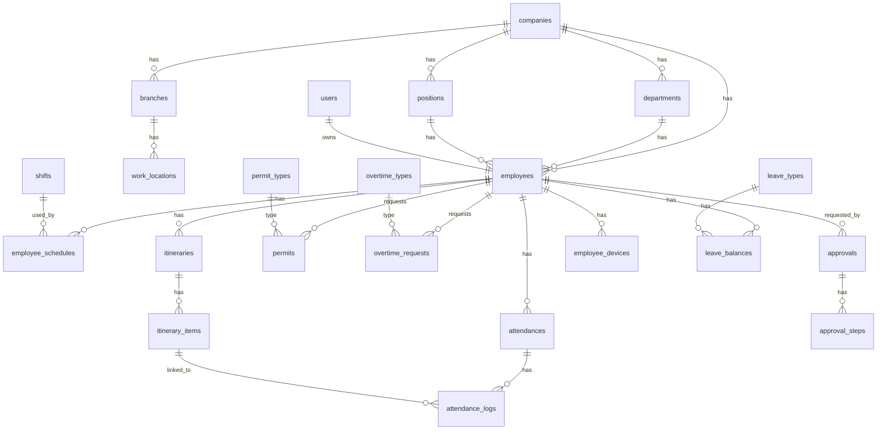
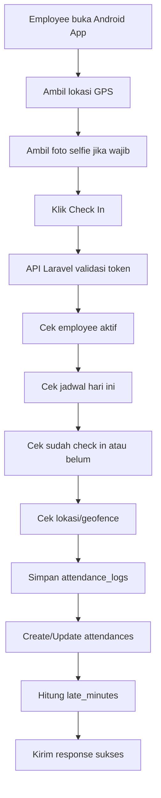
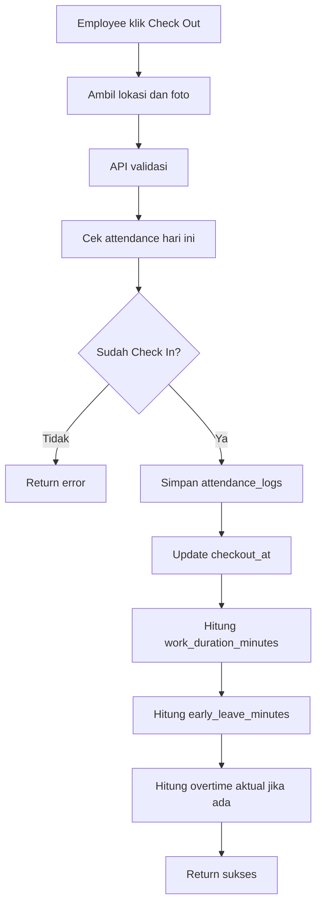
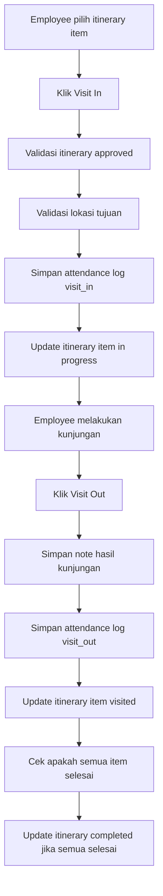
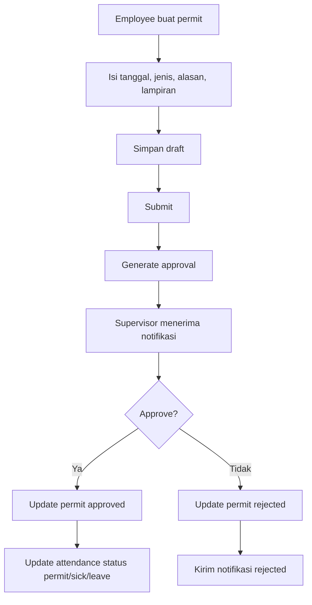
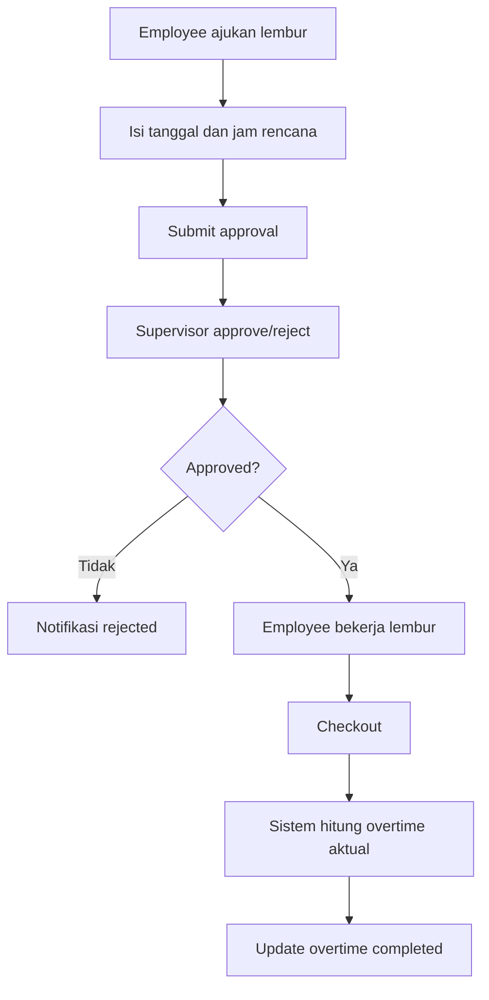

# Rancangan Sistem Aplikasi Attendance

Dokumen ini dibuat sebagai rancangan awal untuk pengembangan aplikasi **Attendance / Absensi Karyawan** berbasis:

- **Backend Web Admin**: Laravel
- **Database**: MySQL
- **UI Web Admin**: Tailwind CSS
- **Aplikasi User**: Android
- **API**: REST API Laravel Sanctum / Token Based Authentication

Fitur utama:

1. Kehadiran
   - Check In
   - Check Out
   - Visit In
   - Visit Out
2. Atur Jadwal / Itinerary
3. Permit
   - Izin
   - Sakit
   - Cuti
4. Overtime / Lembur
5. Approval bertingkat
6. Rekap dan laporan
7. Tracking lokasi dan bukti foto
8. Admin panel untuk HR / Supervisor / Manager

---

## 1. Tujuan Sistem

Sistem ini digunakan untuk mencatat, mengelola, dan memvalidasi aktivitas kehadiran karyawan, baik di kantor, di lapangan, maupun saat kunjungan kerja.

Aplikasi Android digunakan oleh karyawan untuk melakukan absensi dan pengajuan. Web admin digunakan oleh HR, admin, supervisor, dan manager untuk mengelola data, approval, jadwal, serta laporan.

---

## 2. Aktor / Role Pengguna

### 2.1 Super Admin

Hak akses penuh ke seluruh sistem.

Fitur:

- Mengelola company / organisasi
- Mengelola user admin
- Mengelola role dan permission
- Mengelola konfigurasi sistem
- Melihat semua laporan
- Mengelola master data global

### 2.2 Admin HR

Fitur:

- Mengelola data karyawan
- Mengelola divisi, jabatan, lokasi kerja
- Mengelola shift dan jadwal kerja
- Melihat dan ekspor laporan absensi
- Mengelola permit, overtime, dan itinerary
- Melakukan koreksi data attendance jika diperlukan

### 2.3 Manager / Supervisor

Fitur:

- Melihat data bawahan
- Menyetujui / menolak permit
- Menyetujui / menolak overtime
- Menyetujui / menolak itinerary
- Melihat laporan tim

### 2.4 Employee / User Android

Fitur:

- Login aplikasi
- Check In
- Check Out
- Visit In
- Visit Out
- Melihat jadwal kerja
- Melihat itinerary
- Mengajukan izin, sakit, cuti
- Mengajukan overtime
- Melihat riwayat absensi
- Melihat status approval

---

## 3. Modul Sistem

### 3.1 Authentication & Authorization

Backend menggunakan Laravel auth dengan token API untuk aplikasi Android.

Rekomendasi:

- Laravel Sanctum untuk API token
- Spatie Laravel Permission untuk role & permission
- Password hashing default Laravel
- Optional: device binding untuk membatasi login dari perangkat tertentu

Fitur:

- Login web admin
- Login Android
- Logout
- Refresh user profile
- Change password
- Forgot password
- Role & permission
- Device registration

---

### 3.2 Master Data

Master data yang perlu disediakan:

- Company
- Branch / cabang
- Department / divisi
- Position / jabatan
- Employee
- Work location
- Shift
- Holiday
- Leave type
- Permit type
- Overtime type

---

### 3.3 Attendance

Attendance adalah modul utama untuk pencatatan kehadiran harian.

Jenis aktivitas:

1. **Check In**
   - Digunakan saat mulai kerja
   - Bisa divalidasi dengan lokasi, foto, jadwal, device

2. **Check Out**
   - Digunakan saat selesai kerja
   - Bisa menghitung total jam kerja

3. **Visit In**
   - Digunakan saat mulai kunjungan ke lokasi tertentu
   - Biasanya untuk sales, teknisi, field officer, surveyor

4. **Visit Out**
   - Digunakan saat selesai kunjungan
   - Bisa disertai catatan, foto, dan lokasi

Validasi yang disarankan:

- User sudah login
- Jadwal hari ini tersedia
- Check in tidak boleh dobel dalam satu tanggal kerja
- Check out hanya boleh jika sudah check in
- Visit out hanya boleh jika sudah visit in aktif
- Lokasi berada dalam radius jika lokasi kerja wajib geofence
- Foto wajib jika konfigurasi mewajibkan
- Device cocok jika device binding aktif
- Offline mode perlu sync queue dan validasi timestamp

---

### 3.4 Itinerary / Jadwal Kunjungan

Itinerary digunakan untuk mengatur rencana kunjungan karyawan.

Contoh penggunaan:

- Sales visit ke customer
- Teknisi visit ke lokasi client
- Survey lapangan
- Jadwal perjalanan dinas harian

Status itinerary:

- Draft
- Submitted
- Approved
- Rejected
- In Progress
- Completed
- Cancelled

Data itinerary:

- Tanggal
- Employee
- Tujuan / customer / lokasi
- Jam rencana mulai
- Jam rencana selesai
- Alamat
- Latitude longitude
- Catatan
- Approval supervisor

Relasi ke attendance:

- Visit In / Visit Out dapat dikaitkan ke itinerary detail
- Satu itinerary bisa memiliki banyak titik kunjungan

---

### 3.5 Permit / Izin, Sakit, Cuti

Permit digunakan untuk pengajuan ketidakhadiran.

Jenis permit:

- Izin
- Sakit
- Cuti
- Dinas luar
- Terlambat
- Pulang cepat
- Lainnya

Status permit:

- Draft
- Submitted
- Approved
- Rejected
- Cancelled

Fitur:

- Pengajuan dari Android
- Upload lampiran seperti surat dokter
- Approval supervisor / HR
- Catatan approval / rejection
- Perhitungan kuota cuti
- Integrasi ke laporan attendance

---

### 3.6 Overtime / Lembur

Overtime digunakan untuk pengajuan dan pencatatan kerja lembur.

Flow yang disarankan:

1. Employee mengajukan lembur
2. Supervisor menyetujui
3. Employee melakukan check out sesuai lembur
4. Sistem menghitung durasi lembur aktual
5. HR melakukan final approval jika diperlukan

Jenis overtime:

- Before shift
- After shift
- Holiday overtime
- Weekend overtime
- Emergency overtime

Status:

- Draft
- Submitted
- Approved
- Rejected
- Cancelled
- Completed

---

### 3.7 Approval Workflow

Approval dibuat fleksibel agar bisa digunakan oleh beberapa modul.

Modul yang membutuhkan approval:

- Permit
- Overtime
- Itinerary
- Koreksi attendance

Konsep:

- Setiap request memiliki approval status
- Approval bisa 1 level atau multi level
- Approver bisa supervisor langsung, manager, atau HR
- Riwayat approval disimpan pada tabel terpisah

---

### 3.8 Notification

Notifikasi dapat digunakan untuk:

- Pengajuan permit baru
- Pengajuan overtime baru
- Pengajuan itinerary baru
- Approval diterima
- Approval ditolak
- Reminder check in
- Reminder check out
- Reminder visit
- Jadwal berubah

Channel:

- In-app notification
- Firebase Cloud Messaging untuk Android
- Email optional
- WhatsApp optional jika nanti ingin diintegrasikan

---

### 3.9 Report / Laporan

Laporan web admin:

- Rekap attendance harian
- Rekap attendance bulanan
- Keterlambatan
- Pulang cepat
- Tidak hadir
- Izin / sakit / cuti
- Overtime
- Visit report
- Itinerary report
- Lokasi attendance
- Export Excel / CSV / PDF

---

## 4. Arsitektur Sistem

```text
+---------------------+          +-------------------------+
| Android App         |          | Web Admin Tailwind CSS  |
| Employee User       |          | HR / Supervisor / Admin |
+----------+----------+          +------------+------------+
           |                                  |
           | REST API                         | Web Route
           |                                  |
+----------v----------------------------------v------------+
|                    Laravel Backend                       |
| - Auth / Sanctum                                         |
| - Attendance Service                                     |
| - Permit Service                                         |
| - Overtime Service                                       |
| - Itinerary Service                                      |
| - Approval Service                                       |
| - Report Service                                         |
+----------------------------+-----------------------------+
                             |
                             |
+----------------------------v-----------------------------+
|                         MySQL                            |
+----------------------------------------------------------+
                             |
                             |
+----------------------------v-----------------------------+
| Storage                                                      |
| - Attendance Photos                                         |
| - Permit Attachments                                        |
| - Visit Attachments                                         |
| - Export Files                                              |
+-------------------------------------------------------------+
```

---

## 5. Rekomendasi Struktur Laravel

```text
app/
├── Actions/
│   ├── Attendance/
│   ├── Permit/
│   ├── Overtime/
│   └── Itinerary/
├── DTOs/
├── Enums/
├── Events/
├── Exceptions/
├── Exports/
├── Http/
│   ├── Controllers/
│   │   ├── Admin/
│   │   └── Api/
│   ├── Middleware/
│   ├── Requests/
│   └── Resources/
├── Jobs/
├── Models/
├── Notifications/
├── Policies/
├── Services/
│   ├── AttendanceService.php
│   ├── GeoLocationService.php
│   ├── ApprovalService.php
│   ├── ScheduleService.php
│   ├── PermitService.php
│   ├── OvertimeService.php
│   └── ReportService.php
└── Support/
```

---

## 6. Struktur Database

> Catatan:
>
> - Gunakan `bigint unsigned` untuk primary key.
> - Gunakan soft delete untuk master data penting.
> - Gunakan timezone konsisten, disarankan simpan datetime dalam UTC dan tampilkan sesuai timezone company.
> - Untuk MySQL, gunakan `decimal(10,7)` untuk latitude longitude.
> - Gunakan `json` untuk metadata tambahan yang fleksibel.

---

## 7. Entity Relationship Diagram



---

# 8. Detail Tabel Database

---

## 8.1 `companies`

Menyimpan data perusahaan / organisasi.

| Field | Type | Keterangan |
|---|---|---|
| id | bigint unsigned PK | Primary key |
| name | varchar(150) | Nama perusahaan |
| code | varchar(50) unique | Kode perusahaan |
| timezone | varchar(80) | Contoh: Asia/Jakarta |
| logo | varchar(255) nullable | Path logo |
| address | text nullable | Alamat |
| phone | varchar(50) nullable | Telepon |
| email | varchar(150) nullable | Email |
| is_active | boolean | Status aktif |
| settings | json nullable | Konfigurasi tambahan |
| created_at | timestamp |  |
| updated_at | timestamp |  |
| deleted_at | timestamp nullable | Soft delete |

---

## 8.2 `branches`

Cabang perusahaan.

| Field | Type | Keterangan |
|---|---|---|
| id | bigint unsigned PK | Primary key |
| company_id | bigint unsigned FK | Relasi ke companies |
| name | varchar(150) | Nama cabang |
| code | varchar(50) | Kode cabang |
| address | text nullable | Alamat |
| latitude | decimal(10,7) nullable | Latitude |
| longitude | decimal(10,7) nullable | Longitude |
| radius_meter | int default 100 | Radius geofence cabang |
| is_active | boolean | Status aktif |
| created_at | timestamp |  |
| updated_at | timestamp |  |
| deleted_at | timestamp nullable | Soft delete |

Index:

- `company_id`
- `code`

---

## 8.3 `departments`

Divisi / departemen.

| Field | Type | Keterangan |
|---|---|---|
| id | bigint unsigned PK | Primary key |
| company_id | bigint unsigned FK | Relasi ke companies |
| name | varchar(150) | Nama divisi |
| code | varchar(50) nullable | Kode divisi |
| parent_id | bigint unsigned nullable | Untuk sub-department |
| is_active | boolean | Status aktif |
| created_at | timestamp |  |
| updated_at | timestamp |  |
| deleted_at | timestamp nullable | Soft delete |

---

## 8.4 `positions`

Jabatan karyawan.

| Field | Type | Keterangan |
|---|---|---|
| id | bigint unsigned PK | Primary key |
| company_id | bigint unsigned FK | Relasi ke companies |
| name | varchar(150) | Nama jabatan |
| code | varchar(50) nullable | Kode jabatan |
| level | int nullable | Level jabatan |
| is_active | boolean | Status aktif |
| created_at | timestamp |  |
| updated_at | timestamp |  |
| deleted_at | timestamp nullable | Soft delete |

---

## 8.5 `users`

User login sistem. Menggunakan tabel default Laravel, ditambah field tambahan.

| Field | Type | Keterangan |
|---|---|---|
| id | bigint unsigned PK | Primary key |
| name | varchar(150) | Nama user |
| email | varchar(150) unique nullable | Email |
| phone | varchar(50) unique nullable | Nomor HP |
| password | varchar(255) | Password hash |
| avatar | varchar(255) nullable | Foto profil |
| user_type | enum | `super_admin`, `admin`, `employee` |
| is_active | boolean | Status aktif |
| last_login_at | timestamp nullable | Login terakhir |
| remember_token | varchar(100) nullable | Default Laravel |
| created_at | timestamp |  |
| updated_at | timestamp |  |
| deleted_at | timestamp nullable | Soft delete |

Catatan:

- Role detail sebaiknya menggunakan package Spatie Permission.
- Employee login Android tetap menggunakan tabel users.

---

## 8.6 `employees`

Data karyawan.

| Field | Type | Keterangan |
|---|---|---|
| id | bigint unsigned PK | Primary key |
| user_id | bigint unsigned FK nullable | Relasi ke users |
| company_id | bigint unsigned FK | Relasi ke companies |
| branch_id | bigint unsigned FK nullable | Cabang |
| department_id | bigint unsigned FK nullable | Divisi |
| position_id | bigint unsigned FK nullable | Jabatan |
| supervisor_id | bigint unsigned FK nullable | Atasan langsung, relasi ke employees |
| employee_no | varchar(80) | NIK / nomor karyawan |
| full_name | varchar(150) | Nama lengkap |
| gender | enum nullable | `male`, `female` |
| birth_date | date nullable | Tanggal lahir |
| join_date | date nullable | Tanggal masuk |
| resign_date | date nullable | Tanggal resign |
| employment_status | enum | `permanent`, `contract`, `probation`, `intern`, `resigned` |
| phone | varchar(50) nullable | Nomor HP |
| email | varchar(150) nullable | Email kerja |
| address | text nullable | Alamat |
| photo | varchar(255) nullable | Foto karyawan |
| is_active | boolean | Status aktif |
| created_at | timestamp |  |
| updated_at | timestamp |  |
| deleted_at | timestamp nullable | Soft delete |

Unique:

- `company_id`, `employee_no`

Index:

- `company_id`
- `branch_id`
- `department_id`
- `supervisor_id`

---

## 8.7 `work_locations`

Lokasi kerja resmi untuk validasi geofence.

| Field | Type | Keterangan |
|---|---|---|
| id | bigint unsigned PK | Primary key |
| company_id | bigint unsigned FK | Relasi company |
| branch_id | bigint unsigned FK nullable | Relasi branch |
| name | varchar(150) | Nama lokasi |
| type | enum | `office`, `client`, `project`, `warehouse`, `other` |
| address | text nullable | Alamat |
| latitude | decimal(10,7) | Latitude |
| longitude | decimal(10,7) | Longitude |
| radius_meter | int default 100 | Radius validasi |
| is_active | boolean | Status aktif |
| created_at | timestamp |  |
| updated_at | timestamp |  |
| deleted_at | timestamp nullable | Soft delete |

---

## 8.8 `shifts`

Master shift kerja.

| Field | Type | Keterangan |
|---|---|---|
| id | bigint unsigned PK | Primary key |
| company_id | bigint unsigned FK | Relasi company |
| name | varchar(100) | Nama shift |
| code | varchar(50) nullable | Kode shift |
| start_time | time | Jam mulai kerja |
| end_time | time | Jam selesai kerja |
| break_start_time | time nullable | Mulai istirahat |
| break_end_time | time nullable | Selesai istirahat |
| grace_checkin_minutes | int default 0 | Toleransi terlambat |
| grace_checkout_minutes | int default 0 | Toleransi checkout |
| is_cross_day | boolean default false | Shift melewati tengah malam |
| required_checkin | boolean default true | Wajib check in |
| required_checkout | boolean default true | Wajib check out |
| is_active | boolean | Status aktif |
| created_at | timestamp |  |
| updated_at | timestamp |  |
| deleted_at | timestamp nullable | Soft delete |

---

## 8.9 `employee_schedules`

Jadwal kerja karyawan.

| Field | Type | Keterangan |
|---|---|---|
| id | bigint unsigned PK | Primary key |
| employee_id | bigint unsigned FK | Relasi employee |
| shift_id | bigint unsigned FK nullable | Relasi shift |
| work_location_id | bigint unsigned FK nullable | Lokasi kerja |
| schedule_date | date | Tanggal jadwal |
| schedule_type | enum | `workday`, `dayoff`, `holiday`, `remote`, `field` |
| planned_start_at | datetime nullable | Jadwal mulai custom |
| planned_end_at | datetime nullable | Jadwal selesai custom |
| note | text nullable | Catatan |
| created_by | bigint unsigned FK nullable | User pembuat |
| created_at | timestamp |  |
| updated_at | timestamp |  |

Unique:

- `employee_id`, `schedule_date`

Index:

- `schedule_date`
- `shift_id`
- `work_location_id`

---

## 8.10 `holidays`

Hari libur nasional / perusahaan.

| Field | Type | Keterangan |
|---|---|---|
| id | bigint unsigned PK | Primary key |
| company_id | bigint unsigned FK | Relasi company |
| holiday_date | date | Tanggal libur |
| name | varchar(150) | Nama hari libur |
| type | enum | `national`, `company`, `regional` |
| is_paid | boolean default true | Libur berbayar |
| created_at | timestamp |  |
| updated_at | timestamp |  |

Unique:

- `company_id`, `holiday_date`

---

## 8.11 `attendances`

Ringkasan attendance per employee per tanggal kerja.

| Field | Type | Keterangan |
|---|---|---|
| id | bigint unsigned PK | Primary key |
| employee_id | bigint unsigned FK | Relasi employee |
| employee_schedule_id | bigint unsigned FK nullable | Relasi jadwal |
| attendance_date | date | Tanggal kerja |
| status | enum | `present`, `late`, `absent`, `permit`, `sick`, `leave`, `holiday`, `dayoff`, `incomplete` |
| checkin_at | datetime nullable | Waktu check in |
| checkout_at | datetime nullable | Waktu check out |
| checkin_log_id | bigint unsigned nullable | Relasi ke attendance_logs |
| checkout_log_id | bigint unsigned nullable | Relasi ke attendance_logs |
| work_duration_minutes | int default 0 | Total durasi kerja |
| late_minutes | int default 0 | Total menit terlambat |
| early_leave_minutes | int default 0 | Pulang cepat |
| overtime_minutes | int default 0 | Menit lembur aktual |
| is_manual_correction | boolean default false | Koreksi manual |
| correction_note | text nullable | Catatan koreksi |
| created_at | timestamp |  |
| updated_at | timestamp |  |

Unique:

- `employee_id`, `attendance_date`

Index:

- `attendance_date`
- `status`

---

## 8.12 `attendance_logs`

Log detail aktivitas absensi.

| Field | Type | Keterangan |
|---|---|---|
| id | bigint unsigned PK | Primary key |
| attendance_id | bigint unsigned FK nullable | Relasi attendance |
| employee_id | bigint unsigned FK | Relasi employee |
| employee_schedule_id | bigint unsigned FK nullable | Relasi jadwal |
| itinerary_item_id | bigint unsigned FK nullable | Relasi visit ke itinerary item |
| log_type | enum | `checkin`, `checkout`, `visit_in`, `visit_out` |
| logged_at | datetime | Waktu absensi menurut server |
| client_logged_at | datetime nullable | Waktu dari device |
| latitude | decimal(10,7) nullable | Latitude |
| longitude | decimal(10,7) nullable | Longitude |
| accuracy_meter | decimal(8,2) nullable | Akurasi GPS |
| altitude | decimal(10,2) nullable | Altitude optional |
| address_text | text nullable | Reverse geocode |
| photo_path | varchar(255) nullable | Selfie / bukti foto |
| note | text nullable | Catatan |
| source | enum | `android`, `web_admin`, `system`, `import` |
| validation_status | enum | `valid`, `warning`, `invalid`, `pending` |
| validation_message | text nullable | Pesan validasi |
| is_inside_geofence | boolean nullable | Apakah dalam radius |
| distance_from_location_meter | decimal(10,2) nullable | Jarak dari lokasi |
| device_id | bigint unsigned nullable | Relasi employee_devices |
| ip_address | varchar(80) nullable | IP |
| user_agent | text nullable | User agent |
| metadata | json nullable | Data tambahan |
| created_at | timestamp |  |
| updated_at | timestamp |  |

Index:

- `employee_id`, `logged_at`
- `log_type`
- `attendance_id`
- `itinerary_item_id`

---

## 8.13 `attendance_corrections`

Pengajuan atau catatan koreksi attendance.

| Field | Type | Keterangan |
|---|---|---|
| id | bigint unsigned PK | Primary key |
| attendance_id | bigint unsigned FK | Relasi attendance |
| employee_id | bigint unsigned FK | Relasi employee |
| requested_by | bigint unsigned FK | User pengaju |
| correction_type | enum | `missing_checkin`, `missing_checkout`, `wrong_time`, `wrong_location`, `other` |
| old_data | json nullable | Data lama |
| requested_data | json | Data yang diminta |
| reason | text | Alasan |
| status | enum | `submitted`, `approved`, `rejected`, `cancelled` |
| approved_by | bigint unsigned nullable | User approver |
| approved_at | datetime nullable | Waktu approval |
| rejected_reason | text nullable | Alasan reject |
| created_at | timestamp |  |
| updated_at | timestamp |  |

---

## 8.14 `itineraries`

Header itinerary / rencana kunjungan.

| Field | Type | Keterangan |
|---|---|---|
| id | bigint unsigned PK | Primary key |
| company_id | bigint unsigned FK | Relasi company |
| employee_id | bigint unsigned FK | Employee pemilik itinerary |
| itinerary_no | varchar(80) unique | Nomor itinerary |
| title | varchar(150) | Judul |
| itinerary_date | date | Tanggal itinerary |
| status | enum | `draft`, `submitted`, `approved`, `rejected`, `in_progress`, `completed`, `cancelled` |
| submitted_at | datetime nullable | Waktu submit |
| approved_by | bigint unsigned nullable | User approver |
| approved_at | datetime nullable | Waktu approved |
| rejected_by | bigint unsigned nullable | User reject |
| rejected_at | datetime nullable | Waktu rejected |
| rejected_reason | text nullable | Alasan reject |
| note | text nullable | Catatan |
| created_by | bigint unsigned FK nullable | User pembuat |
| created_at | timestamp |  |
| updated_at | timestamp |  |
| deleted_at | timestamp nullable | Soft delete |

Index:

- `employee_id`, `itinerary_date`
- `status`

---

## 8.15 `itinerary_items`

Detail titik kunjungan.

| Field | Type | Keterangan |
|---|---|---|
| id | bigint unsigned PK | Primary key |
| itinerary_id | bigint unsigned FK | Relasi itinerary |
| sequence_no | int | Urutan visit |
| customer_name | varchar(150) nullable | Nama customer / tujuan |
| location_name | varchar(150) | Nama lokasi |
| address | text nullable | Alamat |
| latitude | decimal(10,7) nullable | Latitude |
| longitude | decimal(10,7) nullable | Longitude |
| radius_meter | int default 100 | Radius geofence |
| planned_start_at | datetime nullable | Rencana mulai |
| planned_end_at | datetime nullable | Rencana selesai |
| actual_visit_in_at | datetime nullable | Aktual visit in |
| actual_visit_out_at | datetime nullable | Aktual visit out |
| visit_in_log_id | bigint unsigned nullable | Relasi attendance_logs |
| visit_out_log_id | bigint unsigned nullable | Relasi attendance_logs |
| status | enum | `pending`, `visited`, `skipped`, `cancelled` |
| note | text nullable | Catatan rencana |
| result_note | text nullable | Hasil kunjungan |
| created_at | timestamp |  |
| updated_at | timestamp |  |

Index:

- `itinerary_id`
- `status`

---

## 8.16 `permit_types`

Master jenis permit.

| Field | Type | Keterangan |
|---|---|---|
| id | bigint unsigned PK | Primary key |
| company_id | bigint unsigned FK | Relasi company |
| name | varchar(100) | Nama permit |
| code | varchar(50) | Kode |
| category | enum | `permit`, `sick`, `leave`, `business_trip`, `late`, `early_leave`, `other` |
| requires_attachment | boolean default false | Wajib lampiran |
| deduct_leave_balance | boolean default false | Potong saldo cuti |
| is_paid | boolean default true | Dibayar |
| max_days | int nullable | Maksimal hari |
| is_active | boolean default true | Status aktif |
| created_at | timestamp |  |
| updated_at | timestamp |  |
| deleted_at | timestamp nullable | Soft delete |

---

## 8.17 `permits`

Pengajuan izin, sakit, cuti.

| Field | Type | Keterangan |
|---|---|---|
| id | bigint unsigned PK | Primary key |
| company_id | bigint unsigned FK | Relasi company |
| employee_id | bigint unsigned FK | Relasi employee |
| permit_type_id | bigint unsigned FK | Jenis permit |
| permit_no | varchar(80) unique | Nomor pengajuan |
| start_date | date | Tanggal mulai |
| end_date | date | Tanggal selesai |
| total_days | decimal(5,2) | Total hari |
| reason | text | Alasan |
| attachment_path | varchar(255) nullable | Lampiran |
| status | enum | `draft`, `submitted`, `approved`, `rejected`, `cancelled` |
| submitted_at | datetime nullable | Waktu submit |
| approved_by | bigint unsigned nullable | User approver |
| approved_at | datetime nullable | Waktu approved |
| rejected_by | bigint unsigned nullable | User reject |
| rejected_at | datetime nullable | Waktu rejected |
| rejected_reason | text nullable | Alasan reject |
| created_by | bigint unsigned FK nullable | User pembuat |
| created_at | timestamp |  |
| updated_at | timestamp |  |
| deleted_at | timestamp nullable | Soft delete |

Index:

- `employee_id`, `start_date`, `end_date`
- `status`

---

## 8.18 `leave_types`

Master jenis cuti.

| Field | Type | Keterangan |
|---|---|---|
| id | bigint unsigned PK | Primary key |
| company_id | bigint unsigned FK | Relasi company |
| name | varchar(100) | Nama cuti |
| code | varchar(50) | Kode |
| annual_quota_days | decimal(5,2) default 0 | Jatah tahunan |
| carry_forward_allowed | boolean default false | Bisa carry forward |
| max_carry_forward_days | decimal(5,2) default 0 | Maks carry forward |
| is_active | boolean default true | Status aktif |
| created_at | timestamp |  |
| updated_at | timestamp |  |
| deleted_at | timestamp nullable | Soft delete |

---

## 8.19 `leave_balances`

Saldo cuti karyawan.

| Field | Type | Keterangan |
|---|---|---|
| id | bigint unsigned PK | Primary key |
| employee_id | bigint unsigned FK | Relasi employee |
| leave_type_id | bigint unsigned FK | Relasi leave type |
| year | int | Tahun |
| opening_balance | decimal(5,2) default 0 | Saldo awal |
| earned | decimal(5,2) default 0 | Penambahan |
| used | decimal(5,2) default 0 | Terpakai |
| remaining | decimal(5,2) default 0 | Sisa |
| created_at | timestamp |  |
| updated_at | timestamp |  |

Unique:

- `employee_id`, `leave_type_id`, `year`

---

## 8.20 `overtime_types`

Master jenis lembur.

| Field | Type | Keterangan |
|---|---|---|
| id | bigint unsigned PK | Primary key |
| company_id | bigint unsigned FK | Relasi company |
| name | varchar(100) | Nama overtime |
| code | varchar(50) | Kode |
| multiplier | decimal(5,2) default 1 | Faktor perhitungan optional |
| is_active | boolean default true | Status aktif |
| created_at | timestamp |  |
| updated_at | timestamp |  |
| deleted_at | timestamp nullable | Soft delete |

---

## 8.21 `overtime_requests`

Pengajuan lembur.

| Field | Type | Keterangan |
|---|---|---|
| id | bigint unsigned PK | Primary key |
| company_id | bigint unsigned FK | Relasi company |
| employee_id | bigint unsigned FK | Relasi employee |
| overtime_type_id | bigint unsigned FK nullable | Jenis lembur |
| overtime_no | varchar(80) unique | Nomor pengajuan |
| overtime_date | date | Tanggal lembur |
| planned_start_at | datetime | Rencana mulai |
| planned_end_at | datetime | Rencana selesai |
| actual_start_at | datetime nullable | Aktual mulai |
| actual_end_at | datetime nullable | Aktual selesai |
| planned_duration_minutes | int default 0 | Rencana durasi |
| actual_duration_minutes | int default 0 | Aktual durasi |
| reason | text | Alasan |
| status | enum | `draft`, `submitted`, `approved`, `rejected`, `cancelled`, `completed` |
| submitted_at | datetime nullable | Waktu submit |
| approved_by | bigint unsigned nullable | User approver |
| approved_at | datetime nullable | Waktu approved |
| rejected_by | bigint unsigned nullable | User reject |
| rejected_at | datetime nullable | Waktu rejected |
| rejected_reason | text nullable | Alasan reject |
| created_by | bigint unsigned FK nullable | User pembuat |
| created_at | timestamp |  |
| updated_at | timestamp |  |
| deleted_at | timestamp nullable | Soft delete |

Index:

- `employee_id`, `overtime_date`
- `status`

---

## 8.22 `approvals`

Header approval generik untuk berbagai modul.

| Field | Type | Keterangan |
|---|---|---|
| id | bigint unsigned PK | Primary key |
| company_id | bigint unsigned FK | Relasi company |
| approvable_type | varchar(150) | Model terkait, contoh `App\Models\Permit` |
| approvable_id | bigint unsigned | ID data terkait |
| requested_by_employee_id | bigint unsigned nullable | Employee pengaju |
| current_step | int default 1 | Step approval saat ini |
| status | enum | `pending`, `approved`, `rejected`, `cancelled` |
| final_approved_at | datetime nullable | Waktu final approved |
| final_rejected_at | datetime nullable | Waktu final rejected |
| created_at | timestamp |  |
| updated_at | timestamp |  |

Index:

- `approvable_type`, `approvable_id`
- `status`

---

## 8.23 `approval_steps`

Detail step approval.

| Field | Type | Keterangan |
|---|---|---|
| id | bigint unsigned PK | Primary key |
| approval_id | bigint unsigned FK | Relasi approval |
| step_no | int | Nomor step |
| approver_user_id | bigint unsigned FK nullable | User approver |
| approver_employee_id | bigint unsigned FK nullable | Employee approver |
| status | enum | `pending`, `approved`, `rejected`, `skipped` |
| action_at | datetime nullable | Waktu action |
| note | text nullable | Catatan approval |
| created_at | timestamp |  |
| updated_at | timestamp |  |

Index:

- `approval_id`
- `approver_user_id`
- `status`

---

## 8.24 `employee_devices`

Perangkat Android yang digunakan employee.

| Field | Type | Keterangan |
|---|---|---|
| id | bigint unsigned PK | Primary key |
| employee_id | bigint unsigned FK | Relasi employee |
| device_uuid | varchar(150) | UUID device dari aplikasi |
| device_name | varchar(150) nullable | Nama device |
| platform | varchar(50) default android | Platform |
| os_version | varchar(80) nullable | Versi OS |
| app_version | varchar(80) nullable | Versi aplikasi |
| fcm_token | text nullable | Token Firebase |
| is_primary | boolean default false | Device utama |
| is_active | boolean default true | Status aktif |
| last_used_at | datetime nullable | Terakhir dipakai |
| metadata | json nullable | Data tambahan |
| created_at | timestamp |  |
| updated_at | timestamp |  |

Unique:

- `employee_id`, `device_uuid`

---

## 8.25 `notifications`

Notifikasi internal.

| Field | Type | Keterangan |
|---|---|---|
| id | bigint unsigned PK | Primary key |
| user_id | bigint unsigned FK | Penerima |
| title | varchar(150) | Judul |
| message | text | Isi |
| type | varchar(80) nullable | Jenis notifikasi |
| data | json nullable | Data tambahan |
| read_at | datetime nullable | Waktu dibaca |
| created_at | timestamp |  |
| updated_at | timestamp |  |

---

## 8.26 `app_settings`

Konfigurasi sistem.

| Field | Type | Keterangan |
|---|---|---|
| id | bigint unsigned PK | Primary key |
| company_id | bigint unsigned FK nullable | Null untuk global |
| key | varchar(150) | Key setting |
| value | text nullable | Value |
| value_type | enum | `string`, `integer`, `boolean`, `json` |
| group | varchar(80) nullable | Grup setting |
| created_at | timestamp |  |
| updated_at | timestamp |  |

Unique:

- `company_id`, `key`

Contoh setting:

```json
{
  "attendance.require_selfie": true,
  "attendance.require_gps": true,
  "attendance.allow_outside_geofence": false,
  "attendance.max_gps_accuracy_meter": 100,
  "attendance.enable_device_binding": true,
  "attendance.allow_offline_mode": true,
  "attendance.checkin_grace_minutes": 10
}
```

---

## 8.27 `audit_logs`

Audit log untuk aktivitas penting.

| Field | Type | Keterangan |
|---|---|---|
| id | bigint unsigned PK | Primary key |
| user_id | bigint unsigned FK nullable | User pelaku |
| company_id | bigint unsigned FK nullable | Company |
| action | varchar(150) | Nama aksi |
| auditable_type | varchar(150) nullable | Model terkait |
| auditable_id | bigint unsigned nullable | ID data |
| old_values | json nullable | Data lama |
| new_values | json nullable | Data baru |
| ip_address | varchar(80) nullable | IP |
| user_agent | text nullable | User agent |
| created_at | timestamp |  |

---

# 9. Enum yang Disarankan

## 9.1 Attendance Status

```php
enum AttendanceStatus: string
{
    case PRESENT = 'present';
    case LATE = 'late';
    case ABSENT = 'absent';
    case PERMIT = 'permit';
    case SICK = 'sick';
    case LEAVE = 'leave';
    case HOLIDAY = 'holiday';
    case DAYOFF = 'dayoff';
    case INCOMPLETE = 'incomplete';
}
```

## 9.2 Attendance Log Type

```php
enum AttendanceLogType: string
{
    case CHECKIN = 'checkin';
    case CHECKOUT = 'checkout';
    case VISIT_IN = 'visit_in';
    case VISIT_OUT = 'visit_out';
}
```

## 9.3 Approval Status

```php
enum ApprovalStatus: string
{
    case PENDING = 'pending';
    case APPROVED = 'approved';
    case REJECTED = 'rejected';
    case CANCELLED = 'cancelled';
}
```

## 9.4 Request Status

```php
enum RequestStatus: string
{
    case DRAFT = 'draft';
    case SUBMITTED = 'submitted';
    case APPROVED = 'approved';
    case REJECTED = 'rejected';
    case CANCELLED = 'cancelled';
    case COMPLETED = 'completed';
}
```

---

# 10. API Endpoint Android

Base URL contoh:

```text
https://domainanda.com/api/v1
```

Gunakan header:

```text
Authorization: Bearer {token}
Accept: application/json
Content-Type: application/json
```

Untuk upload foto/lampiran gunakan:

```text
Content-Type: multipart/form-data
```

---

## 10.1 Auth API

| Method | Endpoint | Fungsi |
|---|---|---|
| POST | `/auth/login` | Login user |
| POST | `/auth/logout` | Logout |
| GET | `/auth/me` | Ambil profil login |
| POST | `/auth/change-password` | Ganti password |
| POST | `/auth/register-device` | Registrasi device |
| POST | `/auth/update-fcm-token` | Update FCM token |

### Request Login

```json
{
  "login": "08123456789",
  "password": "password",
  "device_uuid": "android-device-uuid",
  "device_name": "Samsung A52"
}
```

### Response Login

```json
{
  "success": true,
  "message": "Login berhasil",
  "data": {
    "token": "plain-text-token",
    "user": {
      "id": 1,
      "name": "Budi",
      "email": "budi@example.com",
      "phone": "08123456789"
    },
    "employee": {
      "id": 1,
      "employee_no": "EMP001",
      "full_name": "Budi Santoso"
    }
  }
}
```

---

## 10.2 Attendance API

| Method | Endpoint | Fungsi |
|---|---|---|
| GET | `/attendance/today` | Data attendance hari ini |
| GET | `/attendance/history` | Riwayat attendance |
| POST | `/attendance/check-in` | Check in |
| POST | `/attendance/check-out` | Check out |
| POST | `/attendance/visit-in` | Visit in |
| POST | `/attendance/visit-out` | Visit out |
| POST | `/attendance/sync-offline` | Sync data offline |
| POST | `/attendance/correction` | Ajukan koreksi attendance |

### Request Check In / Check Out

Gunakan multipart form-data jika upload foto.

```json
{
  "latitude": -6.2000000,
  "longitude": 106.8166660,
  "accuracy_meter": 20,
  "client_logged_at": "2026-06-30 08:01:00",
  "device_uuid": "android-device-uuid",
  "note": "Masuk kerja",
  "photo": "file"
}
```

### Request Visit In

```json
{
  "itinerary_item_id": 10,
  "latitude": -6.2000000,
  "longitude": 106.8166660,
  "accuracy_meter": 20,
  "client_logged_at": "2026-06-30 10:00:00",
  "device_uuid": "android-device-uuid",
  "note": "Mulai kunjungan customer",
  "photo": "file"
}
```

### Request Visit Out

```json
{
  "itinerary_item_id": 10,
  "latitude": -6.2000000,
  "longitude": 106.8166660,
  "accuracy_meter": 20,
  "client_logged_at": "2026-06-30 11:15:00",
  "device_uuid": "android-device-uuid",
  "note": "Kunjungan selesai, customer tertarik follow up",
  "photo": "file"
}
```

### Response Attendance Today

```json
{
  "success": true,
  "data": {
    "date": "2026-06-30",
    "schedule": {
      "shift_name": "Reguler",
      "start_time": "08:00",
      "end_time": "17:00",
      "location_name": "Kantor Pusat"
    },
    "attendance": {
      "status": "present",
      "checkin_at": "2026-06-30 08:01:00",
      "checkout_at": null,
      "work_duration_minutes": 0,
      "late_minutes": 1
    },
    "active_visit": null
  }
}
```

---

## 10.3 Schedule API

| Method | Endpoint | Fungsi |
|---|---|---|
| GET | `/schedules/today` | Jadwal hari ini |
| GET | `/schedules` | List jadwal berdasarkan tanggal |
| GET | `/schedules/monthly` | Kalender jadwal bulanan |

Query contoh:

```text
GET /schedules?start_date=2026-06-01&end_date=2026-06-30
```

---

## 10.4 Itinerary API

| Method | Endpoint | Fungsi |
|---|---|---|
| GET | `/itineraries` | List itinerary user |
| GET | `/itineraries/today` | Itinerary hari ini |
| POST | `/itineraries` | Buat itinerary |
| GET | `/itineraries/{id}` | Detail itinerary |
| PUT | `/itineraries/{id}` | Update itinerary |
| POST | `/itineraries/{id}/submit` | Submit approval |
| POST | `/itineraries/{id}/cancel` | Cancel itinerary |

### Request Create Itinerary

```json
{
  "title": "Visit Area Jakarta Selatan",
  "itinerary_date": "2026-06-30",
  "note": "Kunjungan prospek baru",
  "items": [
    {
      "sequence_no": 1,
      "customer_name": "PT Maju Jaya",
      "location_name": "Kantor PT Maju Jaya",
      "address": "Jakarta Selatan",
      "latitude": -6.2500000,
      "longitude": 106.8000000,
      "radius_meter": 100,
      "planned_start_at": "2026-06-30 10:00:00",
      "planned_end_at": "2026-06-30 11:00:00",
      "note": "Presentasi produk"
    }
  ]
}
```

---

## 10.5 Permit API

| Method | Endpoint | Fungsi |
|---|---|---|
| GET | `/permit-types` | Master jenis permit |
| GET | `/permits` | List permit user |
| POST | `/permits` | Buat permit |
| GET | `/permits/{id}` | Detail permit |
| PUT | `/permits/{id}` | Update permit |
| POST | `/permits/{id}/submit` | Submit permit |
| POST | `/permits/{id}/cancel` | Cancel permit |

### Request Create Permit

```json
{
  "permit_type_id": 1,
  "start_date": "2026-07-01",
  "end_date": "2026-07-01",
  "reason": "Izin keperluan keluarga",
  "attachment": "file"
}
```

---

## 10.6 Overtime API

| Method | Endpoint | Fungsi |
|---|---|---|
| GET | `/overtime-types` | Master jenis overtime |
| GET | `/overtimes` | List overtime user |
| POST | `/overtimes` | Buat overtime |
| GET | `/overtimes/{id}` | Detail overtime |
| PUT | `/overtimes/{id}` | Update overtime |
| POST | `/overtimes/{id}/submit` | Submit overtime |
| POST | `/overtimes/{id}/cancel` | Cancel overtime |

### Request Create Overtime

```json
{
  "overtime_type_id": 1,
  "overtime_date": "2026-06-30",
  "planned_start_at": "2026-06-30 17:30:00",
  "planned_end_at": "2026-06-30 20:00:00",
  "reason": "Menyelesaikan laporan bulanan"
}
```

---

## 10.7 Notification API

| Method | Endpoint | Fungsi |
|---|---|---|
| GET | `/notifications` | List notifikasi |
| POST | `/notifications/{id}/read` | Tandai sudah dibaca |
| POST | `/notifications/read-all` | Tandai semua dibaca |

---

# 11. Web Admin Routes

Prefix:

```text
/admin
```

## 11.1 Dashboard

| Method | Route | Fungsi |
|---|---|---|
| GET | `/admin/dashboard` | Dashboard utama |

Widget dashboard:

- Jumlah karyawan aktif
- Check in hari ini
- Belum check in
- Terlambat
- Izin / sakit / cuti hari ini
- Pending permit approval
- Pending overtime approval
- Pending itinerary approval
- Grafik attendance bulanan
- Peta lokasi check in terbaru

---

## 11.2 Employee Management

| Method | Route | Fungsi |
|---|---|---|
| GET | `/admin/employees` | List karyawan |
| GET | `/admin/employees/create` | Form tambah |
| POST | `/admin/employees` | Simpan |
| GET | `/admin/employees/{id}` | Detail |
| GET | `/admin/employees/{id}/edit` | Edit |
| PUT | `/admin/employees/{id}` | Update |
| DELETE | `/admin/employees/{id}` | Hapus |

---

## 11.3 Schedule Management

| Method | Route | Fungsi |
|---|---|---|
| GET | `/admin/schedules` | Kalender jadwal |
| POST | `/admin/schedules/generate` | Generate jadwal massal |
| POST | `/admin/schedules/import` | Import jadwal |
| PUT | `/admin/schedules/{id}` | Update jadwal |
| DELETE | `/admin/schedules/{id}` | Hapus jadwal |

---

## 11.4 Attendance Management

| Method | Route | Fungsi |
|---|---|---|
| GET | `/admin/attendances` | List attendance |
| GET | `/admin/attendances/{id}` | Detail attendance |
| POST | `/admin/attendances/manual` | Input manual |
| PUT | `/admin/attendances/{id}/correction` | Koreksi attendance |
| GET | `/admin/attendance-logs` | Log attendance |
| GET | `/admin/attendance-map` | Peta attendance |

---

## 11.5 Permit Management

| Method | Route | Fungsi |
|---|---|---|
| GET | `/admin/permits` | List permit |
| GET | `/admin/permits/{id}` | Detail permit |
| POST | `/admin/permits/{id}/approve` | Approve |
| POST | `/admin/permits/{id}/reject` | Reject |

---

## 11.6 Overtime Management

| Method | Route | Fungsi |
|---|---|---|
| GET | `/admin/overtimes` | List overtime |
| GET | `/admin/overtimes/{id}` | Detail overtime |
| POST | `/admin/overtimes/{id}/approve` | Approve |
| POST | `/admin/overtimes/{id}/reject` | Reject |

---

## 11.7 Itinerary Management

| Method | Route | Fungsi |
|---|---|---|
| GET | `/admin/itineraries` | List itinerary |
| GET | `/admin/itineraries/{id}` | Detail itinerary |
| POST | `/admin/itineraries/{id}/approve` | Approve |
| POST | `/admin/itineraries/{id}/reject` | Reject |
| GET | `/admin/visit-report` | Report visit |

---

## 11.8 Report Management

| Method | Route | Fungsi |
|---|---|---|
| GET | `/admin/reports/attendance` | Report attendance |
| GET | `/admin/reports/attendance/export` | Export attendance |
| GET | `/admin/reports/permit` | Report permit |
| GET | `/admin/reports/overtime` | Report overtime |
| GET | `/admin/reports/visit` | Report visit |
| GET | `/admin/reports/monthly-summary` | Summary bulanan |

---

# 12. Flow Bisnis Utama

---

## 12.1 Flow Check In



Validasi penting:

- Jika tidak ada jadwal:
  - Bisa ditolak, atau
  - Bisa diizinkan dengan status warning, sesuai setting company
- Jika di luar geofence:
  - Bisa ditolak, atau
  - Tetap disimpan dengan validation_status `warning`
- Jika GPS accuracy buruk:
  - Minta user refresh lokasi
- Jika sudah check in:
  - Return error: "Anda sudah melakukan check in"

---

## 12.2 Flow Check Out



---

## 12.3 Flow Visit In / Visit Out



---

## 12.4 Flow Permit



---

## 12.5 Flow Overtime



---

# 13. Logika Perhitungan Attendance

## 13.1 Late Minutes

```text
planned_start = jadwal mulai + grace_checkin_minutes
actual_checkin = checkin_at

Jika actual_checkin > planned_start:
    late_minutes = selisih menit actual_checkin - planned_start
Jika tidak:
    late_minutes = 0
```

## 13.2 Early Leave Minutes

```text
planned_end = jadwal selesai - grace_checkout_minutes
actual_checkout = checkout_at

Jika actual_checkout < planned_end:
    early_leave_minutes = selisih menit planned_end - actual_checkout
Jika tidak:
    early_leave_minutes = 0
```

## 13.3 Work Duration

```text
work_duration = checkout_at - checkin_at - break_duration
```

## 13.4 Overtime Actual

```text
Jika ada overtime approved:
    actual_overtime_start = max(planned_overtime_start, shift_end_time)
    actual_overtime_end = checkout_at
    overtime_minutes = actual_overtime_end - actual_overtime_start
Jika checkout_at <= shift_end_time:
    overtime_minutes = 0
```

---

# 14. Rekomendasi Validasi Anti-Curang

Fitur validasi yang bisa diterapkan bertahap:

1. GPS validation
   - Simpan latitude, longitude, accuracy
   - Tolak jika accuracy lebih dari batas
   - Deteksi lokasi palsu jika memungkinkan dari Android

2. Geofence
   - Hitung jarak user ke work location
   - Simpan distance
   - Beri status valid / warning / invalid

3. Selfie photo
   - Wajib selfie saat check in/out
   - Simpan foto pada storage private
   - Optional: face recognition pada tahap lanjutan

4. Device binding
   - Satu user hanya boleh menggunakan satu device utama
   - Device baru perlu approval admin

5. Server timestamp
   - Waktu utama menggunakan server
   - Waktu device tetap disimpan sebagai pembanding

6. Audit log
   - Semua koreksi manual dicatat
   - Semua approval dicatat

7. Offline sync protection
   - Simpan client timestamp
   - Saat sync, cek apakah timestamp masuk akal
   - Beri flag jika data terlalu lama disinkronkan

---

# 15. Rekomendasi Android App

## 15.1 Fitur Android

Menu utama:

- Dashboard hari ini
- Check In / Check Out
- Visit
- Itinerary
- Permit
- Overtime
- Riwayat
- Notifikasi
- Profil

## 15.2 Data yang Disimpan Lokal

Gunakan Room Database / SQLite untuk:

- User profile cache
- Token
- Jadwal hari ini
- Itinerary hari ini
- Offline attendance queue
- Draft permit
- Draft overtime
- App settings

## 15.3 Offline Mode

Jika internet mati:

1. User tetap bisa melakukan attendance jika setting mengizinkan.
2. Data disimpan ke local queue.
3. Foto disimpan lokal sementara.
4. Saat internet aktif, aplikasi melakukan sync.
5. Backend memberi response valid/warning/invalid.

Struktur payload sync:

```json
{
  "items": [
    {
      "local_id": "uuid-local-1",
      "log_type": "checkin",
      "client_logged_at": "2026-06-30 08:01:00",
      "latitude": -6.2000000,
      "longitude": 106.8166660,
      "accuracy_meter": 20,
      "device_uuid": "android-device-uuid",
      "note": "Offline checkin"
    }
  ]
}
```

---

# 16. Rekomendasi UI Web Admin Tailwind CSS

## 16.1 Layout

Gunakan layout:

- Sidebar kiri
- Topbar
- Content area
- Responsive table
- Filter panel
- Modal create/edit
- Badge status
- Toast notification

## 16.2 Menu Web Admin

```text
Dashboard

Master Data
- Company
- Branch
- Department
- Position
- Employee
- Work Location
- Shift
- Holiday

Attendance
- Daily Attendance
- Attendance Logs
- Manual Correction
- Attendance Map

Schedule
- Calendar
- Generate Schedule
- Import Schedule

Itinerary
- All Itineraries
- Pending Approval
- Visit Report

Permit
- All Permits
- Pending Approval
- Leave Balance

Overtime
- All Overtimes
- Pending Approval

Reports
- Attendance Report
- Permit Report
- Overtime Report
- Visit Report
- Monthly Summary

Settings
- Users
- Roles & Permissions
- App Settings
- Device Management
- Audit Logs
```

## 16.3 Komponen UI yang Disarankan

- Card statistic
- Badge status:
  - Approved: hijau
  - Pending: kuning
  - Rejected: merah
  - Cancelled: abu-abu
- Data table dengan filter:
  - Date range
  - Employee
  - Department
  - Status
- Map view:
  - Marker lokasi check in
  - Marker visit
- Calendar view:
  - Jadwal shift
  - Permit
  - Overtime

---

# 17. Rekomendasi Package Laravel

Package yang disarankan:

```bash
composer require laravel/sanctum
composer require spatie/laravel-permission
composer require maatwebsite/excel
composer require barryvdh/laravel-dompdf
composer require spatie/laravel-activitylog
```

Optional:

```bash
composer require intervention/image
composer require grimzy/laravel-mysql-spatial
```

Catatan:

- `grimzy/laravel-mysql-spatial` opsional jika ingin memakai tipe spatial MySQL.
- Untuk tahap awal, `decimal latitude longitude` sudah cukup.

---

# 18. Rekomendasi Migration Order

Urutan migration agar foreign key tidak bermasalah:

1. companies
2. branches
3. departments
4. positions
5. users
6. employees
7. work_locations
8. shifts
9. holidays
10. employee_schedules
11. attendance tables
    - attendances
    - attendance_logs
    - attendance_corrections
12. itinerary tables
    - itineraries
    - itinerary_items
13. permit tables
    - permit_types
    - leave_types
    - leave_balances
    - permits
14. overtime tables
    - overtime_types
    - overtime_requests
15. approval tables
    - approvals
    - approval_steps
16. employee_devices
17. notifications
18. app_settings
19. audit_logs

---

# 19. Contoh Migration Laravel

## 19.1 Create Attendances Table

```php
Schema::create('attendances', function (Blueprint $table) {
    $table->id();
    $table->foreignId('employee_id')->constrained()->cascadeOnDelete();
    $table->foreignId('employee_schedule_id')->nullable()->constrained()->nullOnDelete();
    $table->date('attendance_date');
    $table->enum('status', [
        'present',
        'late',
        'absent',
        'permit',
        'sick',
        'leave',
        'holiday',
        'dayoff',
        'incomplete'
    ])->default('incomplete');
    $table->dateTime('checkin_at')->nullable();
    $table->dateTime('checkout_at')->nullable();
    $table->unsignedBigInteger('checkin_log_id')->nullable();
    $table->unsignedBigInteger('checkout_log_id')->nullable();
    $table->integer('work_duration_minutes')->default(0);
    $table->integer('late_minutes')->default(0);
    $table->integer('early_leave_minutes')->default(0);
    $table->integer('overtime_minutes')->default(0);
    $table->boolean('is_manual_correction')->default(false);
    $table->text('correction_note')->nullable();
    $table->timestamps();

    $table->unique(['employee_id', 'attendance_date']);
    $table->index(['attendance_date', 'status']);
});
```

## 19.2 Create Attendance Logs Table

```php
Schema::create('attendance_logs', function (Blueprint $table) {
    $table->id();
    $table->foreignId('attendance_id')->nullable()->constrained()->nullOnDelete();
    $table->foreignId('employee_id')->constrained()->cascadeOnDelete();
    $table->foreignId('employee_schedule_id')->nullable()->constrained()->nullOnDelete();
    $table->foreignId('itinerary_item_id')->nullable()->constrained()->nullOnDelete();

    $table->enum('log_type', ['checkin', 'checkout', 'visit_in', 'visit_out']);
    $table->dateTime('logged_at');
    $table->dateTime('client_logged_at')->nullable();

    $table->decimal('latitude', 10, 7)->nullable();
    $table->decimal('longitude', 10, 7)->nullable();
    $table->decimal('accuracy_meter', 8, 2)->nullable();
    $table->decimal('altitude', 10, 2)->nullable();
    $table->text('address_text')->nullable();

    $table->string('photo_path')->nullable();
    $table->text('note')->nullable();

    $table->enum('source', ['android', 'web_admin', 'system', 'import'])->default('android');
    $table->enum('validation_status', ['valid', 'warning', 'invalid', 'pending'])->default('pending');
    $table->text('validation_message')->nullable();

    $table->boolean('is_inside_geofence')->nullable();
    $table->decimal('distance_from_location_meter', 10, 2)->nullable();

    $table->unsignedBigInteger('device_id')->nullable();
    $table->string('ip_address', 80)->nullable();
    $table->text('user_agent')->nullable();
    $table->json('metadata')->nullable();

    $table->timestamps();

    $table->index(['employee_id', 'logged_at']);
    $table->index('log_type');
    $table->index('attendance_id');
    $table->index('itinerary_item_id');
});
```

---

# 20. Service Class yang Disarankan

## 20.1 AttendanceService

Tanggung jawab:

- Validasi check in
- Validasi check out
- Validasi visit in
- Validasi visit out
- Membuat attendance log
- Membuat / update attendance summary
- Menghitung terlambat, pulang cepat, durasi kerja, lembur
- Validasi geofence
- Validasi device

Method contoh:

```php
class AttendanceService
{
    public function checkIn(Employee $employee, array $payload): AttendanceLog
    {
        // 1. Get schedule
        // 2. Validate duplicate checkin
        // 3. Validate location
        // 4. Store photo
        // 5. Create attendance
        // 6. Create attendance log
        // 7. Update attendance summary
    }

    public function checkOut(Employee $employee, array $payload): AttendanceLog
    {
        // 1. Get attendance
        // 2. Validate already checkin
        // 3. Validate checkout duplicate
        // 4. Store log
        // 5. Calculate work duration
        // 6. Calculate overtime
    }

    public function visitIn(Employee $employee, array $payload): AttendanceLog
    {
        // 1. Validate itinerary item
        // 2. Validate location
        // 3. Store visit in log
        // 4. Update itinerary item
    }

    public function visitOut(Employee $employee, array $payload): AttendanceLog
    {
        // 1. Validate active visit
        // 2. Store visit out log
        // 3. Update itinerary item result
    }
}
```

---

## 20.2 GeoLocationService

Tanggung jawab:

- Hitung jarak dua koordinat
- Cek radius geofence
- Reverse geocoding optional

Formula Haversine:

```php
public function distanceInMeters(float $lat1, float $lon1, float $lat2, float $lon2): float
{
    $earthRadius = 6371000;

    $dLat = deg2rad($lat2 - $lat1);
    $dLon = deg2rad($lon2 - $lon1);

    $a = sin($dLat / 2) * sin($dLat / 2)
        + cos(deg2rad($lat1)) * cos(deg2rad($lat2))
        * sin($dLon / 2) * sin($dLon / 2);

    $c = 2 * atan2(sqrt($a), sqrt(1 - $a));

    return $earthRadius * $c;
}
```

---

# 21. Seeder Awal

Data awal yang perlu dibuat:

## 21.1 Roles

- super_admin
- admin_hr
- manager
- supervisor
- employee

## 21.2 Permissions

Contoh permission:

```text
manage_company
manage_branch
manage_department
manage_position
manage_employee
manage_schedule
manage_attendance
view_attendance_report
manage_permit
approve_permit
manage_overtime
approve_overtime
manage_itinerary
approve_itinerary
manage_settings
manage_roles
manage_devices
view_audit_logs
```

## 21.3 Permit Types

- Izin
- Sakit
- Cuti Tahunan
- Dinas Luar
- Terlambat
- Pulang Cepat

## 21.4 Overtime Types

- Lembur Setelah Jam Kerja
- Lembur Sebelum Jam Kerja
- Lembur Hari Libur
- Lembur Weekend

## 21.5 Default App Settings

```text
attendance.require_selfie = true
attendance.require_gps = true
attendance.allow_outside_geofence = false
attendance.max_gps_accuracy_meter = 100
attendance.enable_device_binding = false
attendance.allow_offline_mode = true
attendance.checkin_grace_minutes = 10
attendance.checkout_grace_minutes = 0
```

---

# 22. Tahapan Pengembangan

## Phase 1 - Foundation

Target:

- Setup Laravel
- Auth admin
- Auth API Android
- Role permission
- Master company, branch, department, position
- Employee management
- Work location
- Shift

Output:

- Admin bisa login
- Employee bisa login Android
- Data master siap

---

## Phase 2 - Attendance Core

Target:

- Schedule employee
- Check in
- Check out
- Attendance logs
- Attendance summary
- GPS + selfie
- Attendance history
- Dashboard attendance

Output:

- User bisa absen dari Android
- Admin bisa melihat attendance

---

## Phase 3 - Visit & Itinerary

Target:

- CRUD itinerary
- Approval itinerary
- Visit in
- Visit out
- Visit report
- Map visit

Output:

- User lapangan bisa melakukan visit berbasis itinerary

---

## Phase 4 - Permit

Target:

- Permit type
- Leave type
- Leave balance
- Pengajuan izin/sakit/cuti
- Approval permit
- Update attendance otomatis setelah permit approved

Output:

- User bisa izin/sakit/cuti
- Admin/supervisor bisa approve

---

## Phase 5 - Overtime

Target:

- Overtime type
- Pengajuan overtime
- Approval overtime
- Hitung overtime aktual dari checkout
- Report overtime

Output:

- User bisa mengajukan lembur
- Sistem menghitung lembur aktual

---

## Phase 6 - Report & Export

Target:

- Attendance report
- Permit report
- Overtime report
- Visit report
- Monthly summary
- Export Excel / PDF

Output:

- HR bisa rekap data untuk payroll dan evaluasi

---

## Phase 7 - Hardening

Target:

- Audit log
- Device binding
- Offline sync
- FCM notification
- Optimasi query
- Backup database
- Security hardening

Output:

- Sistem siap produksi

---

# 23. Checklist Security

- Gunakan HTTPS
- Gunakan Laravel Sanctum token
- Rate limit endpoint login
- Validasi semua input dengan Form Request
- File upload hanya tipe tertentu
- Simpan file private jika berisi data sensitif
- Batasi ukuran foto
- Gunakan authorization policy
- Audit log untuk perubahan penting
- Jangan percaya timestamp dari client sebagai waktu utama
- Simpan server timestamp
- Validasi device UUID
- Gunakan queue untuk proses berat
- Backup database berkala
- Gunakan soft delete untuk data penting

---

# 24. Rekomendasi Response Format API

Gunakan format konsisten:

## Success

```json
{
  "success": true,
  "message": "Data berhasil disimpan",
  "data": {}
}
```

## Error Validasi

```json
{
  "success": false,
  "message": "Validasi gagal",
  "errors": {
    "latitude": [
      "Latitude wajib diisi"
    ]
  }
}
```

## Error Business Logic

```json
{
  "success": false,
  "message": "Anda sudah melakukan check in hari ini",
  "code": "ALREADY_CHECKED_IN"
}
```

---

# 25. Struktur Folder Android yang Disarankan

```text
app/
├── data/
│   ├── local/
│   │   ├── dao/
│   │   ├── database/
│   │   └── entity/
│   ├── remote/
│   │   ├── api/
│   │   ├── dto/
│   │   └── interceptor/
│   └── repository/
├── domain/
│   ├── model/
│   └── usecase/
├── presentation/
│   ├── auth/
│   ├── dashboard/
│   ├── attendance/
│   ├── itinerary/
│   ├── permit/
│   ├── overtime/
│   ├── history/
│   └── profile/
└── utils/
```

Rekomendasi teknologi Android:

- Kotlin
- Jetpack Compose atau XML
- Retrofit
- OkHttp
- Room
- DataStore
- WorkManager untuk sync offline
- Firebase Cloud Messaging
- CameraX untuk selfie
- Google Play Services Location

---

# 26. Catatan Penting untuk Antigravity / AI Code Editor

Gunakan instruksi berikut saat meminta AI code editor membuat sistem:

```text
Bangun aplikasi Attendance berbasis Laravel + MySQL + Tailwind CSS untuk web admin, dan REST API untuk aplikasi Android.

Ikuti dokumen rancangan database dan endpoint API ini. Prioritaskan pengembangan bertahap:
1. Setup Laravel, auth, role permission, dan master data.
2. Buat modul employee, work location, shift, dan schedule.
3. Buat modul attendance check in/check out dengan GPS dan selfie.
4. Buat modul itinerary dan visit in/visit out.
5. Buat modul permit izin/sakit/cuti dengan approval.
6. Buat modul overtime dengan approval dan perhitungan aktual.
7. Buat laporan dan export.

Gunakan struktur service class agar business logic tidak menumpuk di controller.
Gunakan Form Request untuk validasi.
Gunakan API Resource untuk response API.
Gunakan Policy/Middleware untuk authorization.
Gunakan migration, model relationship, factory, dan seeder.
```

---

# 27. Prioritas MVP

Agar pengembangan tidak terlalu besar di awal, MVP disarankan fokus ke:

1. Login admin dan employee
2. Master employee
3. Master shift
4. Master work location
5. Schedule employee
6. Check in
7. Check out
8. Attendance history
9. Admin attendance report
10. Permit sederhana
11. Overtime sederhana

Setelah MVP stabil, lanjutkan:

- Itinerary
- Visit in/out
- Multi-level approval
- Offline sync
- Device binding
- Notification
- Advanced report
- Face recognition optional

---

# 28. Catatan Desain Database

Beberapa keputusan desain penting:

1. `attendances` dipakai sebagai ringkasan harian.
2. `attendance_logs` dipakai sebagai riwayat detail semua aktivitas.
3. `visit_in` dan `visit_out` tidak langsung disimpan di kolom utama attendance karena satu hari bisa ada banyak kunjungan.
4. `itinerary_items` bisa terhubung dengan `attendance_logs` untuk membuktikan visit.
5. `approvals` dibuat generik agar bisa digunakan untuk permit, overtime, itinerary, dan koreksi attendance.
6. `employee_schedules` dibuat per tanggal agar mudah melakukan perubahan shift harian.
7. `leave_balances` dipisah agar cuti tahunan mudah dihitung.
8. `employee_devices` disiapkan untuk keamanan Android app.
9. `audit_logs` wajib untuk sistem HR karena data attendance sensitif.
10. `app_settings` membuat sistem fleksibel tanpa sering mengubah kode.

---

# 29. Rekomendasi Index Database

Tambahkan index untuk query yang sering digunakan:

```text
employees:
- company_id
- branch_id
- department_id
- supervisor_id
- employee_no

employee_schedules:
- employee_id, schedule_date
- schedule_date

attendances:
- employee_id, attendance_date
- attendance_date, status
- employee_schedule_id

attendance_logs:
- employee_id, logged_at
- attendance_id
- itinerary_item_id
- log_type

permits:
- employee_id, start_date, end_date
- status

overtime_requests:
- employee_id, overtime_date
- status

itineraries:
- employee_id, itinerary_date
- status

approval_steps:
- approver_user_id, status
```

---

# 30. Penutup

Rancangan ini sudah disiapkan untuk menjadi dasar pengembangan aplikasi Attendance lengkap.

Rekomendasi implementasi:

- Mulai dari MVP terlebih dahulu.
- Jangan langsung mengaktifkan semua fitur anti-curang di awal.
- Pastikan flow attendance stabil.
- Pisahkan business logic di service class.
- Buat API dokumentasi sejak awal.
- Buat seed data agar testing mudah.
- Gunakan staging server sebelum production.

